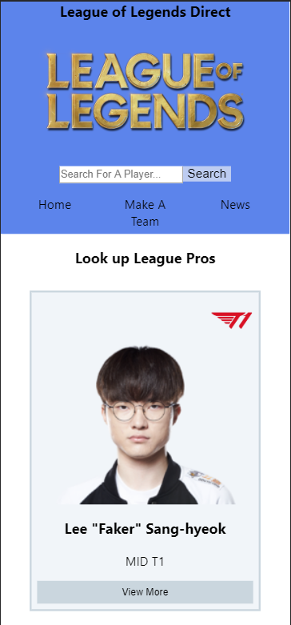
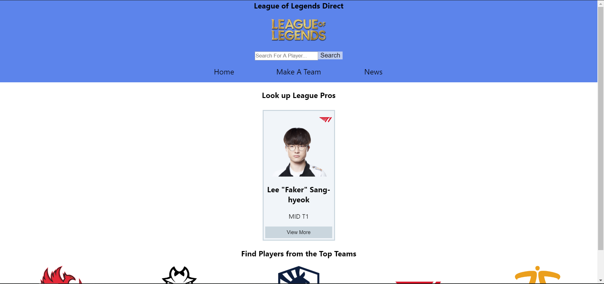

# Project: League Of Legends Direct

Project was bootstrapped via [Create React App](https://github.com/facebook/create-react-app)

<<<<<<< HEAD
## Mobile view (iPhone X):

## Desktop view (1920 x 1080):

### `Tech Used`

- Server Side:

  - Node JS
  - Express JS (Framework)
  - Axios
  - RSS-Parser (NPM Package)

- Client Side:
  - React
  - React Router Dom
  - Axios

=======
### `Tech Used`

>>>>>>> d1e8c74b99f1dcbb9ce377360c97a63d34983d3e
### `What is it?`

Look up professional League of Legends players, the latest League of Legends News all in one place. This site is both mobile and desktop friendly.

Player data was pulled via [PandaScore](https://pandascore.co/welcome).
News data was supplied via [Esports Subreddit](https://www.reddit.com/r/esports/)
<<<<<<< HEAD
The design was inspired by [OP.GG](https://na.op.gg/)
=======
>>>>>>> d1e8c74b99f1dcbb9ce377360c97a63d34983d3e

### `Why Make This?`

I am a League of Legends player and fan of [Esports](https://en.wikipedia.org/wiki/Esports) and wanted to create something that I am passionate about.

I enjoyed designing and making this application. I was able to practice improve my HTML / CSS by making this responsive to mobile and desktop screens.

### `How Do I Run This?`

<<<<<<< HEAD
Live Demo: [Click Here](https://infinite-cove-15888.herokuapp.com/)
=======
Live Demo: [Click Here](https://jp-sdev.github.io/countryPicker1.0/)
>>>>>>> d1e8c74b99f1dcbb9ce377360c97a63d34983d3e
